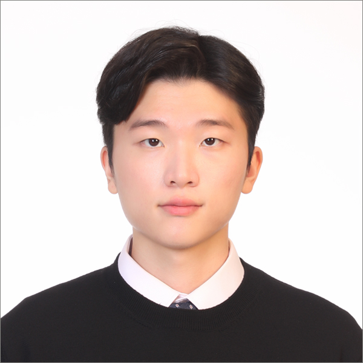

## About Me
\
Hi, my name is Kilhoon but just call me Andy. Here's my [Social Links](#social-links)\
I'm undergraduate junior student at Univesity of California, San Diego.\
I am majoring **computer science**.
My favorite language is **C++** so far, but I am recently interested on **Python**.\
One of quote that I like:
> _You see, antiquated ideas of kindness and generosity are simply bugs that must be programmed out of our world._\
> _And these cold, unfeeling machines will show us the way. -Bill Gates_

## Classes that I have taken from school:
- CS A150: C++ Programming Language 1 [Orange Coast College](https://orangecoastcollege.edu/academics/business-computing/computer-science/courses.html)
- CS A170: Java Programming 1 [Orange Coast College](https://orangecoastcollege.edu/academics/business-computing/computer-science/courses.html)
- CS A200: Data Structures [Orange Coast College](https://orangecoastcollege.edu/academics/business-computing/computer-science/courses.html)
- CS A250: C++ Programming Language 2 [Orange Coast College](https://orangecoastcollege.edu/academics/business-computing/computer-science/courses.html)
- CS A262: Discrete Structures [Orange Coast College](https://orangecoastcollege.edu/academics/business-computing/computer-science/courses.html)
- CSE 21: Mathematics for Algorithms and Systems [University of California, San Diego](https://catalog.ucsd.edu/courses/CSE.html)
- CSE 29: Systems Programming and Software Tools [University of California, San Diego](https://catalog.ucsd.edu/courses/CSE.html)
- CSE 30: Computer Organization [University of California, San Diego](https://catalog.ucsd.edu/courses/CSE.html)
- CSE 100: Advanced Data Structures [University of California, San Diego](https://catalog.ucsd.edu/courses/CSE.html)
- CSE 101: Design and Analysis of Algorithms [University of California, San Diego](https://catalog.ucsd.edu/courses/CSE.html)

## My Skills
1. **Languages**: C++, C, Python, Java
2. **Tools**: Git, Visual Studio Code

I got interested on 
```
git status
git add
git commit
```

## Things that I want to achieve this year:
- [ ] Internship
- [ ] Expand Social Network
- [ ] Find specific industry I want to work on\

## Social Links
- [Linked in](https://www.linkedin.com/in/kilhoon-kim-24886a244/)
- [HandShake](https://ucsd.joinhandshake.com/profiles/6yrtq5)

